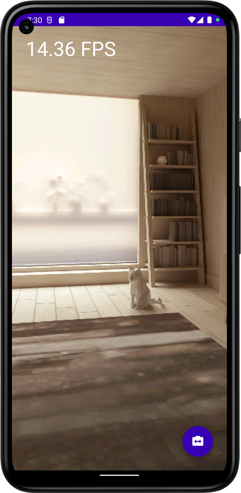
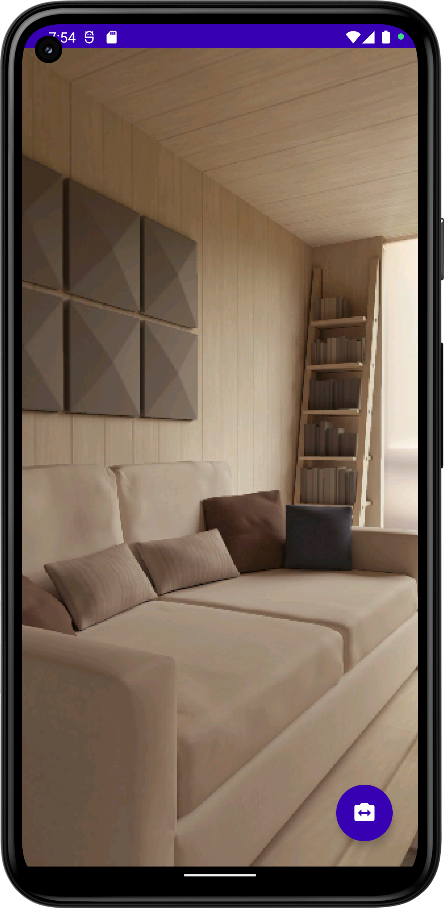

# CvCamera-Mobile

Utilizing OpenCV4 with Android's Camera2 API through JavaCamera2View

 

    
    

This android project is barebone setting up OpenCV 4.10.0 (and other 4.x.y versions) for Android in [Android Studio](https://developer.android.com/studio) with Native Development Kit (NDK) support.
[Android NDK](https://developer.android.com/ndk) enables you to implement your [OpenCV](https://opencv.org) image processing pipeline in C++ and call that C++ code from Android Kotlin/Java code through JNI ([Java Native Interface](https://en.wikipedia.org/wiki/Java_Native_Interface)).

This Android application, provides a live camera feed with the ability to dynamically switch between front and back cameras. It includes a custom cvFpsMeter for enhanced text visibility. Also features a basic setup for Android NDK and OpenCV, as well as a CV filter with a toggle button for camera switching.

## How to use this repository

1. [Download and Install Android Studio](https://developer.android.com/studio)

2. [Install NDK and CMake](https://developer.android.com/studio/projects/install-ndk.md)

3. Clone this repository as an Android Studio project :
     * In Android Studio, click on `File -> New -> Project from Version Control -> Git`
     * Paste this repository *Github URL*, choose a *project directory* and click next.

4. Install *OpenCV Android release* :
    * Download [OpenCV 4.10.0 Android release](https://github.com/opencv/opencv/releases/download/4.10.0/opencv-4.10.0-android-sdk.zip) or download latest available Android release on [OpenCV website](https://opencv.org/releases/).
    * Unzip downloaded file and put **OpenCV-android-sdk** directory next your project and rename folder `opencvsdk4100`. If you want to place somewhere else please change path in `settings.gradle`

    * Optional(For linux) you can run setupOpenCV.sh for automatic download and setup gradle file for opencv

5. Sync Gradle and run the application on your Android Device!

# Features

* **OpenCV Version Update**: The OpenCV version was updated multiple times, with the latest being 4.10.0.
* **Camera Switch**: Added the ability to switch between the front and back camera.
* **SetupOpenCV Script**: Introduced a script for setting up OpenCV.
* **Custom cvFpsMeter**: Implemented a custom cvFpsMeter for bigger text and different color choice.
* **Material3 Theme**: Added configurations for the Material3 theme.
* **UI Overhaul**: The user interface was significantly updated, and strings were added.
* **Timber Logging**: Added Timber logging for fpsMeter and ExtendedJavaCamera2View.
* **Android NDK - OpenCV Basic Setup**: Implemented a basic setup for Android NDK and OpenCV.
* **CV Filter with Toggle Button**: Added a basic CV filter with a toggle button to switch between the front and back camera.
* **NDK Version only**: TBD

# Keywords

Kotlin, OpenCV 4, Android, Android Studio, Native, NDK, Native Development Kit, JNI, C++,
