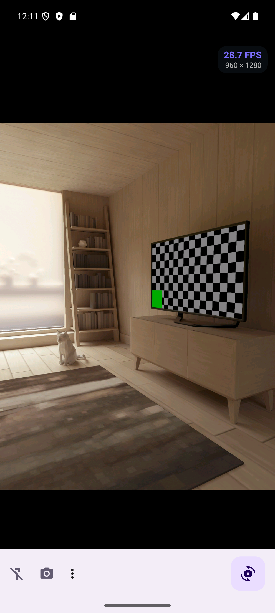
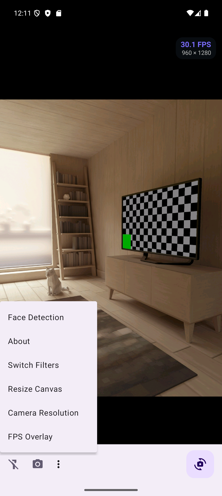
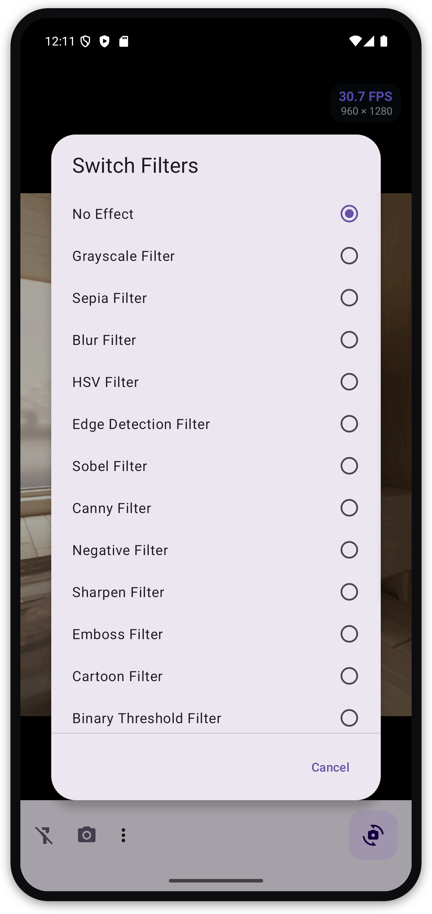

<div align="center">

# CvCamera-Mobile

**A production-shaped OpenCV 4 camera template for Android. Camera2 preview, a native C++/JNI bridge, and every feature in its own pluggable file.**

[](https://opensource.org/license/mit/)
[](https://opencv.org/)
[](https://kotlinlang.org/)
[](https://openjdk.org/)
[](https://gradle.org/releases/)
[](https://developer.android.com/build/releases/gradle-plugin)
[](https://developer.android.com/tools/releases/platforms)

[](https://github.com/onuralpszr/CvCamera-Mobile/actions/workflows/android-ci-debug.yml)
[](https://github.com/onuralpszr/CvCamera-Mobile/actions/workflows/android-ci-release.yml)
[](https://results.pre-commit.ci/latest/github/onuralpszr/CvCamera-Mobile/main)
[](https://www.codefactor.io/repository/github/onuralpszr/cvcamera-mobile/overview/main)
[](https://snyk.io/test/github/onuralpszr/CvCamera-Mobile)
[](https://conventionalcommits.org)





</div>

---

## What this is

A barebones but complete starting point for OpenCV 4.x on Android. It wires up a live
[Camera2](https://developer.android.com/media/camera/camera2) preview through OpenCV's
`JavaCamera2View`, adds an [NDK](https://developer.android.com/ndk) bridge so the same frames can be
processed in C++ via [JNI](https://en.wikipedia.org/wiki/Java_Native_Interface), and keeps every
user-facing capability in its own file.

The last part is the point: the app doubles as a template. Each feature is a `CameraFeature`
registered on one line, so the project can be reduced to a bare preview or extended without
touching unrelated code.

## Examples

Three apps, one per integration style, all sharing the same OpenCV SDK module.

| Module | Language | Processing | What it shows |
| --- | --- | --- | --- |
| `app/` | Kotlin | OpenCV Java bindings | The full app: effects, face detection, torch, capture, pluggable features |
| `java/` | Java | OpenCV Java bindings | The same camera pipeline with no Kotlin anywhere |
| `cpp/` | Kotlin plus C++ | Native `cv::` over JNI | Frame processing in C++, with only the `Mat` address crossing the boundary |

`app/` has no native code at all, so it is the reference for a pure Java bindings integration.
`cpp/` is the reference for doing the work in C++. Build any of them with
`./gradlew :app:installDebug`, `:java:installDebug` or `:cpp:installDebug`.

## Camera features

| Feature | File | Notes |
| --- | --- | --- |
| Effect picker | `features/FilterPicker.kt` | 16 OpenCV effects, "No Effect" default, applied per frame |
| Face detection | `features/FaceDetection.kt` | Haar cascade, boxes drawn on the frame |
| Resolution picker | `features/ResolutionPicker.kt` | Every supported size, with aspect ratio and megapixels |
| Canvas fit / fill | `features/CanvasScaleControl.kt` | Letterbox or centre-crop, no camera restart |
| Flash torch | `features/TorchControl.kt` | Availability-checked per camera |
| FPS overlay | `features/FpsOverlayControl.kt` | Tinted chip, toggleable |
| Shutter flash | `features/ShutterEffect.kt` | Flash plus the system shutter sound |
| Photo orientation | `features/PhotoOrientation.kt` | Writes the EXIF orientation tag |
| Rotating controls | `features/ControlsRotator.kt` | Icons rotate, the bar stays at the bottom |

Also included: front/back switching and capture to `MediaStore`.

## Adding or removing a feature

Features are registered in a single list in `MainActivity`:

```kotlin
private val features: List<CameraFeature> by lazy {
    listOf(
        FilterPicker(this),
        FaceDetection(this),
        ResolutionPicker(this, binding.CvCamera),
        // ...
    )
}
```

The list order is also the frame-processing order, so effects run before face boxes are drawn on
top. A new capability means a new file implementing `CameraFeature` plus one line here. Dropping a
capability means deleting its file and its line.

`CameraFeature` provides `attach`/`detach`, `onResume`/`onPause`, `onMenuItemSelected`,
`processFrame`, `onCameraSwitched`, `onPhotoCaptureStarted` and `onPhotoSaved`, all optional.

## Getting started

1. [Install Android Studio](https://developer.android.com/studio).
2. [Install the NDK and CMake](https://developer.android.com/studio/projects/install-ndk).
3. Install **JDK 21**.
4. Clone the repository, then fetch the OpenCV SDK:

   ```sh
   ./setupOpenCV_4x.sh
   ```

   This downloads the OpenCV 4.14.0 Android SDK, verifies its SHA-256, extracts it to
   `opencvsdk4140/`, and applies the patches in `patches/`. Re-running it on a prepared SDK is a
   no-op.

   To do it by hand instead: download the
   [OpenCV 4.14.0 Android release](https://github.com/opencv/opencv/releases/download/4.14.0/opencv-4.14.0-android-sdk.zip),
   unzip it beside the project, rename `OpenCV-android-sdk` to `opencvsdk4140`, and adjust the
   path in `settings.gradle.kts` if you put it elsewhere.

5. Sync Gradle and run on a device:

   ```sh
   ./gradlew installDebug
   ```

### Running without a device

The Android emulator's `virtualscene` back camera renders a 3D room, which is enough to exercise
the preview, effects and capture:

```sh
emulator -avd <name> -camera-back virtualscene -no-snapshot-load
./gradlew installDebug
adb shell pm grant com.os.cvCamera android.permission.CAMERA
adb shell am start -n com.os.cvCamera/.MainActivity
```

`-no-snapshot-load` matters: loading a snapshot written by a different GPU backend crashes the
emulator with "change of renderer detected".

## Development

```sh
./gradlew spotlessApply                      # format (ktlint)
./gradlew spotlessCheck assembleDebug \
          :app:lintDebug :app:testDebugUnitTest   # what CI runs
```

* **Version catalog**: every dependency and SDK level lives in `gradle/libs.versions.toml`.
* **Kotlin DSL**: all build scripts are `.kts`.
* **Spotless + ktlint**: enforced in CI.
* **Timber**: logging, debug builds only.
* **Conventional commits**: enforced by convention; `cliff.toml` drives the changelog.

`CvCheckUnitTest` asserts the linked OpenCV version, which is the guard that the SDK swap in
`setupOpenCV_4x.sh` actually took effect.

## Keywords

Kotlin, OpenCV 4, Android, Android Studio, Camera2, NDK, JNI, C++, Version Catalog, Kotlin DSL,
Spotless, Material 3
